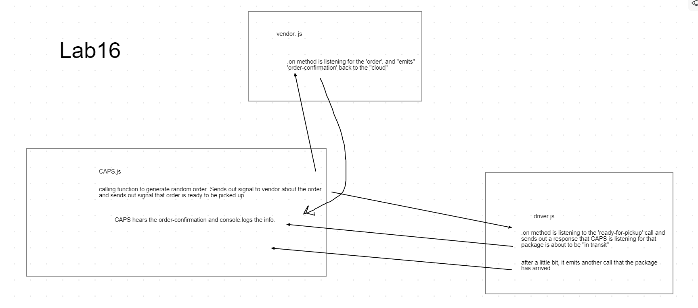

# LAB16 - Class 16

## Project: Event Driven Applications

### Author: Garhett Morgan  
### Links and Resources

- [submission PR](https://github.com/garhett-401/CAPS/pull/1)

### Setup

#### `.env` requirements (where applicable)

i.e.

- `PORT` - Port Number
- `MONGODB_URI` - URL to the running mongo instance/db

#### How to initialize/run your application (where applicable)

-`node caps.js`

#### How to use your library (where applicable)

#### Tests

- How do you run tests?
- Any tests of note?
- Describe any tests that you did not complete, skipped, etc

#### UML

